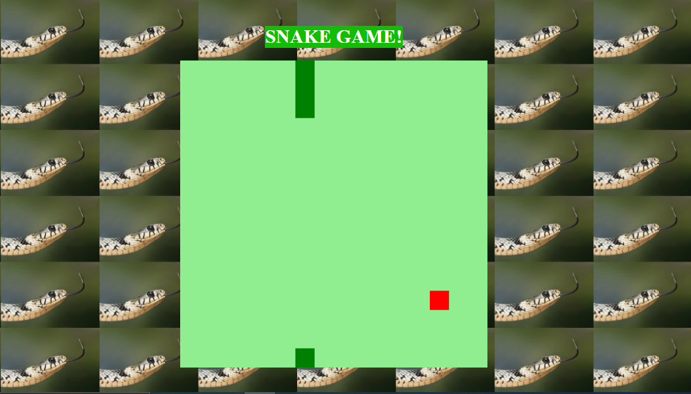

# Projeto de formação jogo da cobrinha (JavaScript)

####O jogo foi criado em HTML, CSS e JavaScript. Com orientação da especialista Gabriela Pinheiro (Frontend Engineer, Cornershop by Uber), através do Bootcamp HTML WEB DEVELOPER da Digital Innovatio One.

